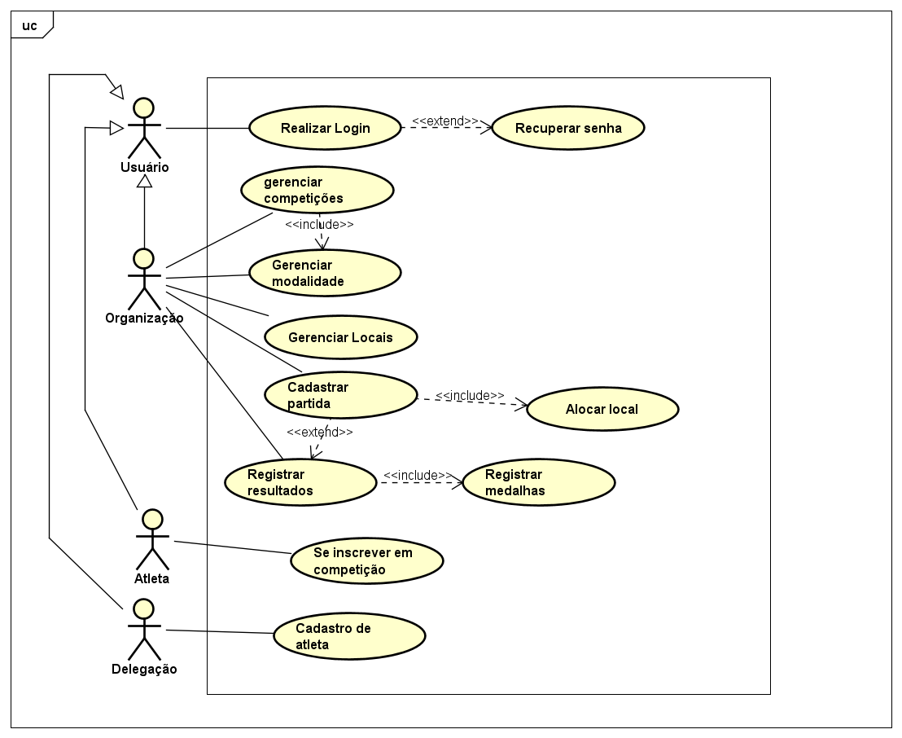
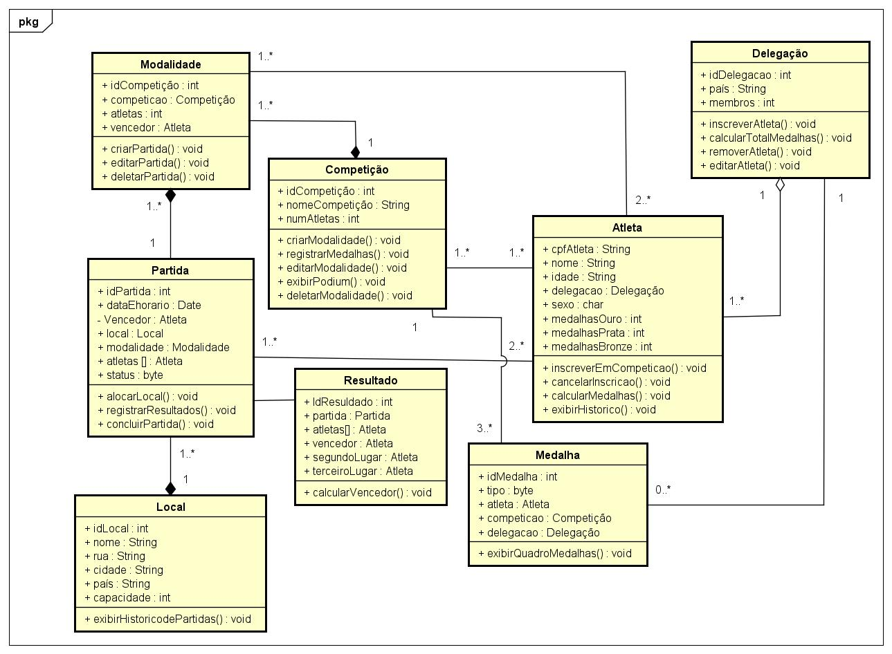
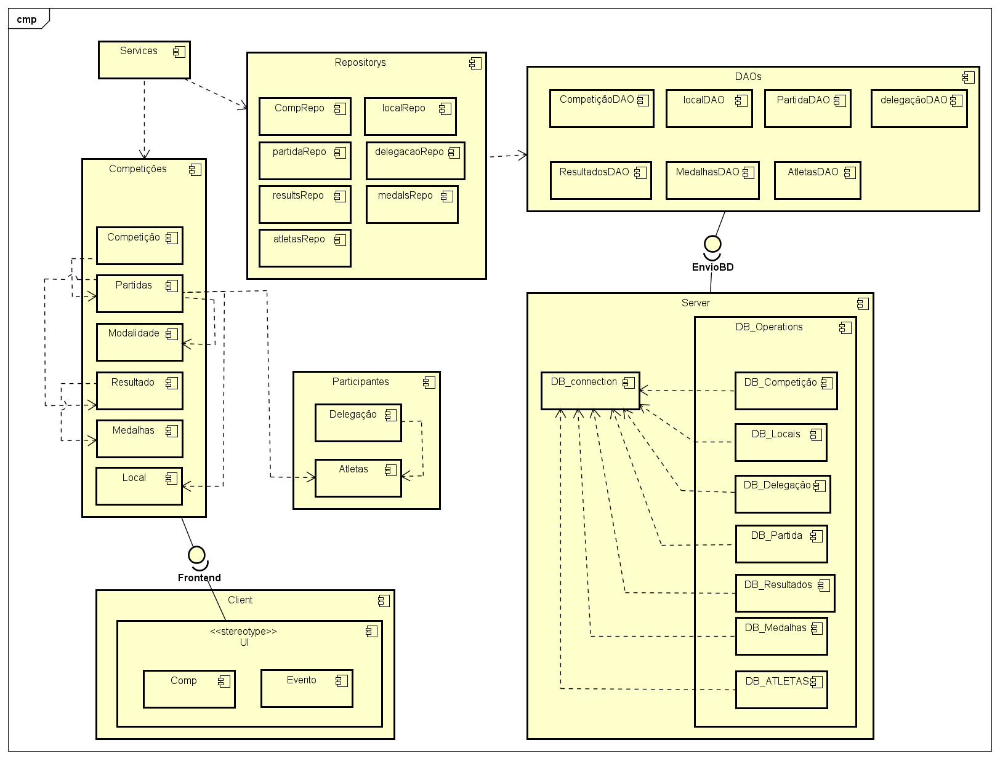

# SGO_projeto_de_sw

Repositório destinado ao trabalho de SGO(Sistema de gestão de olimpiádas) da disciplina de Projeto de Software, do quarto periodo do curso de Engenharia de Software da PUC Minas

Alunos: 
 - Alfredo Luis Vieira
 - Bruno Evangelista Gomes de Azevedo

## Histórias de Usuário

### #US1 - Login de Usuário
Eu como usuário do sistema, gostaria de poder realizar o login, para poder ter acesso a funcionalidades
respectivas a minha posição no contexto.

### #US2 - Criação de competições
Eu como administrador das olímpiadas, gostaria de cadastrar competições, modalidades e partidas no sistema,
para que os atletas possam se cadastrar nas mesmas.

### #US3 - Cadastro de locais
Eu como administrador das olímpiadas, gostaria de cadastrar locais no sistema,
para que as partidas possam ser alocadas nos mesmos.

### #US4 - Registro de Resultados
Eu como administrador das olímpiadas, gostaria de registrar os resultados das competições no sistema,
para que os atletas possam receber suas medalhas.

### #US5 - Relatório de medalhas
Eu como administrador das olímpiadas, gostaria de ter acesso a um relatório de medalhas,
para poder visualizar os países com maior número de medalhas.

### #US6 - Cadastro de atletas
Eu como administrador da delegação, gostaria de cadastrar os nossos atletas, para que os mesmos
possam disputar as partidas.

### #US7 - Inscrição em competições
Eu como atleta, gostaria de me inscrever nas competições desejadas, para poder disputar as mesmas.

## Diagrama de Casos de Uso

## Diagrama de Classes

## Diagrama de Componentes

## Diagrama de Pacotes

## Diagrama de Implantação

